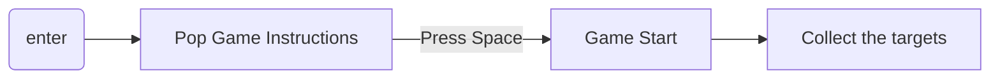
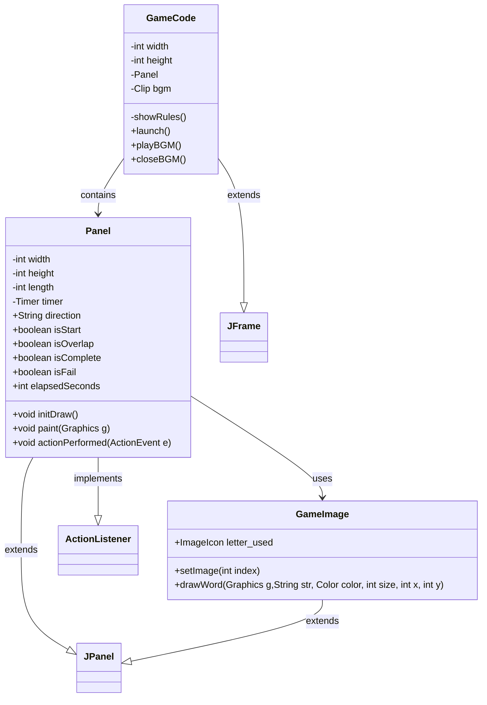
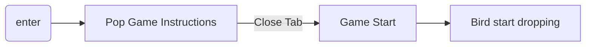
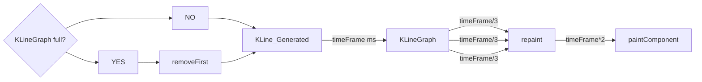
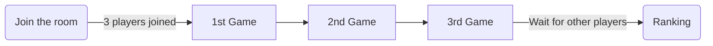
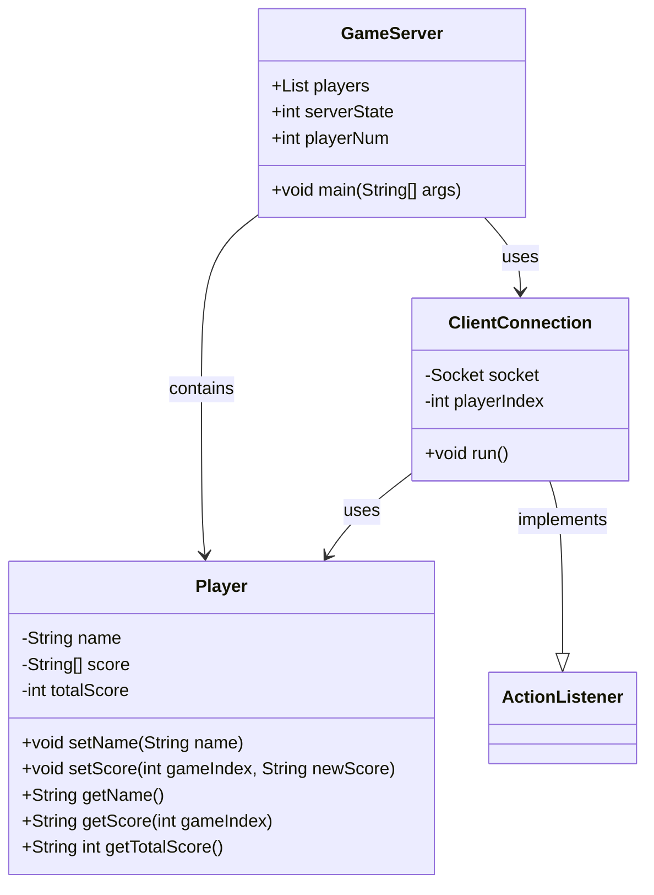

# NCKU股票大進擊

## 動機

身為資工系，一入學的時候充滿了抱負，想要廣泛的學習，增進自己的實力，然後應用所學在有興趣的事情上。

我們設計了一個遊戲來描述資工系的大學生活。

初出茅廬，必須學習好程式語言，才能進行應用。

中期，要學習一些程式以外的知識，學習投資，與寫程式的專長結合。

後期，開始更深入和程式奮鬥，挑戰不同程式語言及應用；同時，避免常常投資失敗變成韭菜。

祝我們都能在未來各自的領域上發光發熱。

## 內容
這是一個多人遊戲系列，在Server端建立房間後，Client端可以進入遊戲房間，
3人到齊，遊戲便會開始。

總共有三個遊戲關卡，
(1) JAVA貪食蛇：程式小白鍛鍊計畫
(2) Flappy Doge：投資韭菜躲避戰
(3) 馬力歐：資工系畢業之路
玩家需要陸續通過這些關卡，最後便能參與成大資工的畢業典禮。
最後會結算三個遊戲的總分，顯示玩家的排名。


# 實作

## JAVA貪食蛇：程式小白鍛鍊計畫

### 概念
蒐集“System.out.println()” 來完成遊戲。
使用鍵盤控制上下左右，控制貪食蛇吃到所有目標字母。
即使完成遊戲，因為少吃了一個";"，還是有可能面臨二一大魔王。

#### 遊戲畫面

#### 遊戲流程



#### Class Diagram


## Flappy Doge：投資韭菜躲避戰

### 概念

用股市的k線圖當作背景，實現flapy bird的遊戲。其中，使用 Doge Coin的圖片作為上下移動的主要標的。隨著過關斬將通過一根根的韭菜(躲避韭菜)，分數持續增加，而k線圖也會追蹤Doge Coin的位置而上下起伏。借助Eclipse的開發工具，加速介面的開發速度。

#### 以contentPane 為基底，增加JPanel

JPanel 的部分有：infoBar, Grids, 格線右邊的數字

#### 遊戲畫面

#### 遊戲流程



#### 格線

override`drawComponent(Graphics g)`，使格線畫在JPanel上。
使用`g.drawLine(x1,y1,x2,y2)`，for迴圈迭代畫出格線。

#### K線

由於畫面佔滿K線之後要將先前畫上去的K線刪除，因此用Deque儲存KLine的object, 只要size超過一定數量就pop front。

每次新增新的KLine後，就要repaint()這個JPanel，然後paintComponent()，因為某些原因repaint()應該要可以call paintComponent() 的，但結果是把整個JPanel上畫好的都刪掉而已。

因此流程改為，每 [timeFrame] ms 新增新的KLine到KLineGraph，然後每[timeFrame/3] ms，call repaint() 刷新JPanel，然後[timeFrame*2] ms後，call paintComponent()。



#### Class Diagram for Doge Game


#### Class Diagram for Dynamic Background

```mermaid
classDiagram
Background <|--JPanel :extends
Grids <|--JPanel  :extends
KLineGraph <|--JPanel :extends
KLineGraph --|> ActionListener :implements
KLineGraph ..|> KLine
Main --|> Background
class Main{
  final BOARD_HEIGHT
  final BOARD_WIDTH
}
class Background{
  +String GRids
  -JPanel contentPane
  static Integer dealNumInteger
  static Double startPriceDouble
  static Double highestPriceDouble
  static Double lowestPriceDouble
  static Double endPriceDouble
  static Double diffPriceDouble

  static JLabel startPrice
  static JLabel endPrice 
  static JLabel highestPrice
  static JLabel lowestPrice
  static JLabel diffPrice
  static JLabel dealAmount
  Background()
  +static updateInfo()
}
class Grids{
  +Grids()
  -int width
  -int height
  -int rows
  -int columns

  # paintComponent()
}
class KLine{
  -double  highest
  -double  lowest
  -double  startPrice
  -double  endPrice
  +KLine(highest, lowest, startPrice, endPrice)
}

class KLineGraph {
  
  Deque<KLine> KLineDeque
  Timer updateLineTimer
  Timer gameLoop
  int timeFrame
  +KLineGraph()
  + setKLine()
  + paintComponent(g)
  + draw()
  +actionPerformed(ActionEvent e)
 
}
  
// Mushroom.java
classDiagram
    class Mushroom {
        -Texture tex
        -float originalY
        -String type
        -boolean appeared
        +Mushroom(float x, float y, String type)
        +tick()
        +render(Graphics g)
        +handleCollision(int contactPoint, GameObject neighbor)
    }

    class GameObject {
        <<abstract>>
        +float x
        +float y
        +int width
        +int height
        +String id
        +String color
        +defaultSpeed
        +setVelocityY(float v)
        +setVelocityX(float v)
        +tick()
        +render(Graphics g)
        +handleCollision(int contactPoint, GameObject neighbor)
    }

    class Texture {
        +get(String name) Texture
    }

    class Game {
        +getTex() Texture
        +HEIGHT
    }

    class Level {
        +removeItem(GameObject item)
    }

    class Player {
        +handleCollision(int contactPoint, GameObject neighbor)
        +moveRight()
        +moveLeft()
    }

    Mushroom --> GameObject
    Mushroom --> Texture
    Mushroom --> Game
    Mushroom --> Level
    Mushroom --> Player

// Enemy.java
classDiagram
    class Mushroom {
        -Texture tex
        -float originalY
        -String type
        -boolean appeared
        +Mushroom(float x, float y, String type)
        +tick()
        +render(Graphics g)
        +handleCollision(int contactPoint, GameObject neighbor)
    }

    class GameObject {
        <<abstract>>
        +float x
        +float y
        +int width
        +int height
        +String id
        +String color
        +defaultSpeed
        +setVelocityY(float v)
        +setVelocityX(float v)
        +tick()
        +render(Graphics g)
        +handleCollision(int contactPoint, GameObject neighbor)
    }

    class Texture {
        +get(String name) Texture
    }

    class Game {
        +getTex() Texture
        +HEIGHT
    }

    class Level {
        +removeItem(GameObject item)
    }

    class Player {
        +handleCollision(int contactPoint, GameObject neighbor)
        +moveRight()
        +moveLeft()
    }

    Mushroom --> GameObject
    Mushroom --> Texture
    Mushroom --> Game
    Mushroom --> Level
    Mushroom --> Player

// Player.java

classDiagram
    class Player {
        -Texture tex
        -boolean movingLeft
        -boolean movingRight
        -boolean isDead
        -String size
        -String state
        -String style
        -String direction
        -int liveCount
        -boolean win
        -static int scoreCount
        -final int CASTLE_X
        -final int CASTLE_Y
        -Game game
        -boolean check
        +Player(float x, float y)
        +static int getScoreCount()
        +static void setScoreCount(int setScore)
        +tick()
        +canDestroyBrick() boolean
        +moveLeft()
        +moveRight()
        +jump()
        +jump(float speed)
        +stopMoveLeft()
        +stopMoveRight()
        +updateSprites()
        +handleCollision(int contactPoint, GameObject neighbor)
        +die()
        +resetPlayer()
        +render(Graphics g)
        +drawLivesCount(Graphics g)
    }

    class GameObject {
        <<abstract>>
        +float x
        +float y
        +int width
        +int height
        +String id
        +BufferedImage[] imgs
        +defaultSpeed
        +setVelocityY(float v)
        +setVelocityX(float v)
        +tick()
        +handleCollision(int contactPoint, GameObject neighbor)
        +moveLeft()
        +moveRight()
        +isFalling() boolean
        +render(Graphics g)
    }

    class Texture {
        +get(String name) Texture
    }

    class Game {
        +getTex() Texture
        +HEIGHT
        +stop(int score, boolean win)
    }

    class Level {
        +removeItem(GameObject item)
    }

    class Window {
        +static boolean isComplete
    }

    class BufferedImage

    Player --> GameObject
    Player --> Texture
    Player --> Game
    Player --> Level
    Player --> Window
    Player --> BufferedImage

// PipeHead.java

classDiagram
    class PipeHead {
        +PipeHead(float x, float y, boolean isVertical)
        +Rectangle getBounds()
    }

    class GameObject {
        <<abstract>>
        +float x
        +float y
        +int width
        +int height
        +String id
        +BufferedImage[] imgs
        +defaultSpeed
        +setVelocityY(float v)
        +setVelocityX(float v)
        +tick()
        +handleCollision(int contactPoint, GameObject neighbor)
        +moveLeft()
        +moveRight()
        +isFalling() boolean
        +render(Graphics g)
    }

    class Texture {
        +get(String name) Texture
    }

    class Game {
        +getTex() Texture
    }

    class Rectangle

    PipeHead --> GameObject
    PipeHead --> Rectangle
    PipeHead --> Game
    PipeHead --> Texture

// BrickBlock.java

classDiagram
    class BrickBlock {
        -Texture tex
        -float originalY
        -int numberOfCoins
        -String style
        +BrickBlock(float x, float y, String style)
        +BrickBlock(float x, float y, String style, int numberOfCoins)
        +tick()
        +handleCollision(int contactPoint, GameObject neighbor)
        +destroyBlock()
    }

    class GameObject {
        <<abstract>>
        +float x
        +float y
        +int width
        +int height
        +String id
        +BufferedImage[] imgs
        +defaultSpeed
        +setVelocityY(float v)
        +setVelocityX(float v)
        +tick()
        +handleCollision(int contactPoint, GameObject neighbor)
        +moveLeft()
        +moveRight()
        +isFalling() boolean
        +render(Graphics g)
    }

    class Texture {
        +get(String name) Texture
    }

    class Game {
        +getTex() Texture
    }

    class Level {
        +addItem(GameObject item)
        +removeItem(GameObject item)
    }

    class Coin {
        +Coin(float x, float y)
    }

    class BrickPiece {
        +BrickPiece(float x, float y, int vx, int vy, String style)
    }

    class Player {
        +canDestroyBrick() boolean
    }

    BrickBlock --> GameObject
    BrickBlock --> Texture
    BrickBlock --> Game
    BrickBlock --> Level
    BrickBlock --> Coin
    BrickBlock --> BrickPiece
    BrickBlock --> Player

// BrickPiece.java

classDiagram
    class BrickPiece {
        -Texture tex
        -float velocityX
        -float velocityY
        -final float gravity
        +BrickPiece(float x, float y, float velocityX, float velocityY, String style)
        +tick()
        +handleCollision(int contactPoint, GameObject neighbor)
    }

    class CanvasItem {
        <<abstract>>
        +float x
        +float y
        +int width
        +int height
        +String color
        +setSprites(Texture tex)
        +setAnimationSpeed(int speed)
        +tick()
        +handleCollision(int contactPoint, GameObject neighbor)
    }

    class Texture {
        +get(String name) Texture
    }

    class Game {
        +getTex() Texture
        +HEIGHT
    }

    class Level {
        +removeItem(GameObject item)
    }

    BrickPiece --> CanvasItem
    BrickPiece --> Texture
    BrickPiece --> Game
    BrickPiece --> Level

// Game.java

classDiagram
    class Game {
        -volatile boolean running
        -Thread thread
        +int WIDTH
        +int HEIGHT
        -Level currentLevel
        -static Texture tex
        +synchronized void start()
        +void stop(int scoreCount, boolean win)
        +void run()
        +void init()
        +void tick()
        +void render()
        +static Texture getTex()
        +boolean getRunning()
        +void setRunning(boolean running)
        +static void main(String[] args)
    }

    class Canvas {
        +int getWidth()
        +int getHeight()
        +BufferStrategy getBufferStrategy()
        +void createBufferStrategy(int numBuffers)
        +void requestFocus()
    }

    class Runnable

    class Thread {
        +void start()
        +void stop()
        +boolean isInterrupted()
    }

    class Level {
        +Level(Game game, String path, String color)
        +void tick()
        +void render(Graphics g)
    }

    class Texture {
        +Texture()
    }

    class OsUtils {
        +static boolean isWindows()
    }

    class Window {
        +Window(int width, int height, String title, Game game)
        +static void closeWindow(int scoreCount, boolean win)
        +void closeBGM()
        +static boolean isComplete
        +static boolean shouldShowScore
    }

    class BufferStrategy {
        +Graphics getDrawGraphics()
        +void show()
    }

    class Graphics {
        +void dispose()
    }

    Game --> Canvas
    Game --> Runnable
    Game --> Thread
    Game --> Level
    Game --> Texture
    Game --> OsUtils
    Game --> Window
    Game --> BufferStrategy
    Game --> Graphics

// Game.java分支圖

graph TD
    A[Game.java] --> B[Canvas]
    A --> C[Runnable]
    A --> D[Thread]
    A --> E[Level]
    A --> F[Texture]
    A --> G[OsUtils]
    A --> H[Window]
    A --> I[BufferStrategy]
    A --> J[Graphics]

    subgraph "Game.java Components"
        A --> B1[volatile boolean running]
        A --> B2[Thread thread]
        A --> B3[int WIDTH]
        A --> B4[int HEIGHT]
        A --> B5[Level currentLevel]
        A --> B6[static Texture tex]
        A --> B7[synchronized void start()]
        A --> B8[void stop(int scoreCount, boolean win)]
        A --> B9[void run()]
        A --> B10[void init()]
        A --> B11[void tick()]
        A --> B12[void render()]
        A --> B13[static Texture getTex()]
        A --> B14[boolean getRunning()]
        A --> B15[void setRunning(boolean running)]
        A --> B16[static void main(String[] args)]
    end

    subgraph "Canvas Components"
        B --> C1[int getWidth()]
        B --> C2[int getHeight()]
        B --> C3[BufferStrategy getBufferStrategy()]
        B --> C4[void createBufferStrategy(int numBuffers)]
        B --> C5[void requestFocus()]
    end

    subgraph "Thread Components"
        D --> D1[void start()]
        D --> D2[void stop()]
        D --> D3[boolean isInterrupted()]
    end

    subgraph "Level Components"
        E --> E1[Level(Game game, String path, String color)]
        E --> E2[void tick()]
        E --> E3[void render(Graphics g)]
    end

    subgraph "Window Components"
        H --> H1[Window(int width, int height, String title, Game game)]
        H --> H2[static void closeWindow(int scoreCount, boolean win)]
        H --> H3[void closeBGM()]
        H --> H4[static boolean isComplete]
        H --> H5[static boolean shouldShowScore]
    end

    subgraph "BufferStrategy Components"
        I --> I1[Graphics getDrawGraphics()]
        I --> I2[void show()]
    end

    subgraph "Graphics Components"
        J --> J1[void dispose()]
    end


```

方型圓邊：起/始點
正方形: process
菱形:decisiion
平行四邊形: I/O


## 韭菜瑪利歐

### 概念

為了運用所學，必須征服一個個的程式語言(敵人)，來增加分數。如果禁止不動的話會變成韭菜，死掉的話會變成韭菜水餃。

## Server 以及 Client端設計
使用Java Socket Programming來建立遊戲系統，Client端程式主要設計遊戲視窗與邏輯、向Server求取其他玩家的資訊，Server端主要在指示Client該跳往哪個遊戲狀態、記錄玩家資訊。
Client在此專案的流程如下：



#### Class Diagram for server


# 困難與解決

## 1.圖片路徑

我們發現Windows和MacOS在讀取照片的時候，所需的路徑不一樣，因此增加了`OsUtil` 來判斷使用者系統，並給予正確的路徑。

Windows:

`app/src/res/path-to-img `

MacOS:

`src/res/path-to-img`

## 2.原本要串Online data base 
較熟悉的Firebase只在移動應用(Android和iOS平台)使用過，但是我們是純JAVA視窗設計
=>直接自行使用Socket Programming，設計Server與Client程式

## 3.一開始不知道怎麼讓server和client準確互相傳送訊息
=>採用Server與Client 一問一答的模式