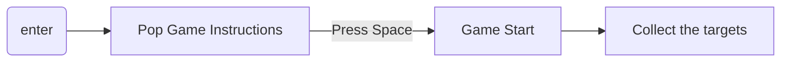
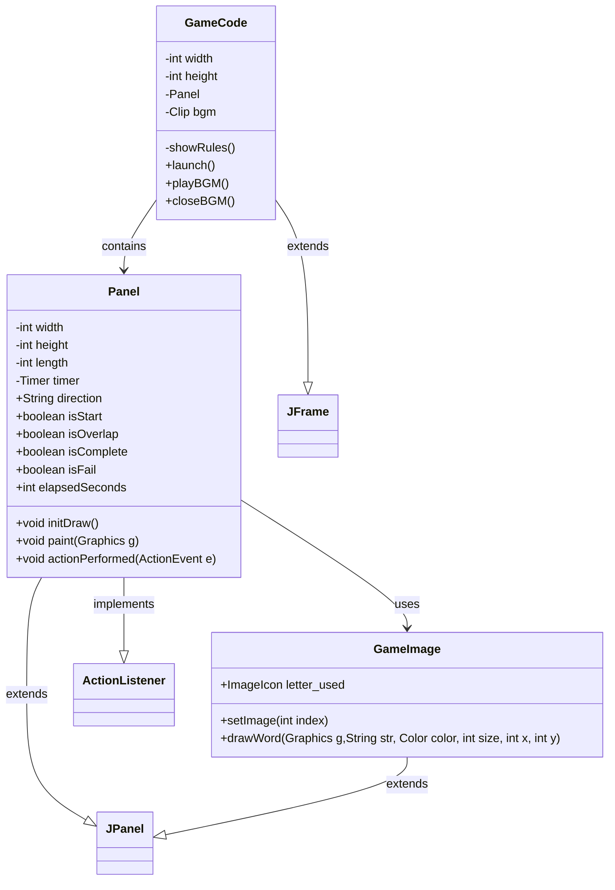
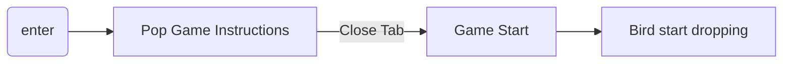
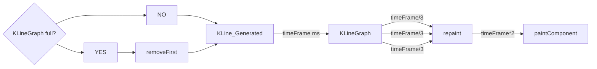
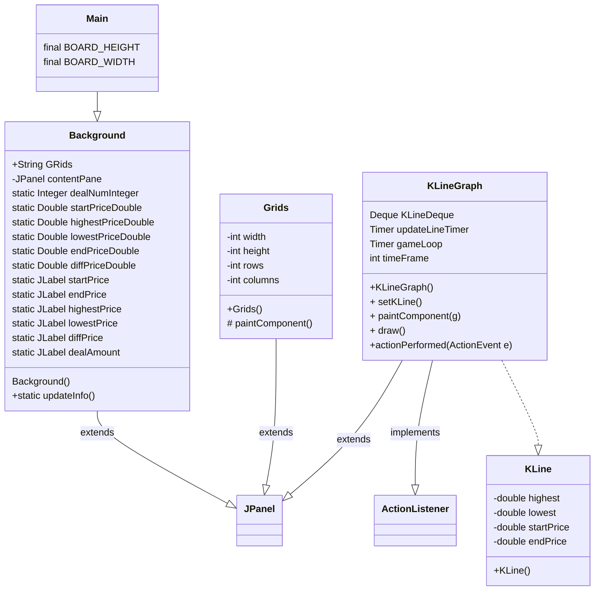
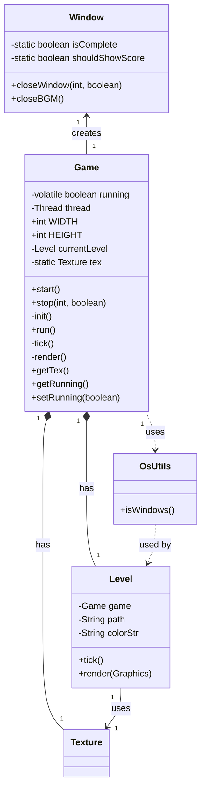
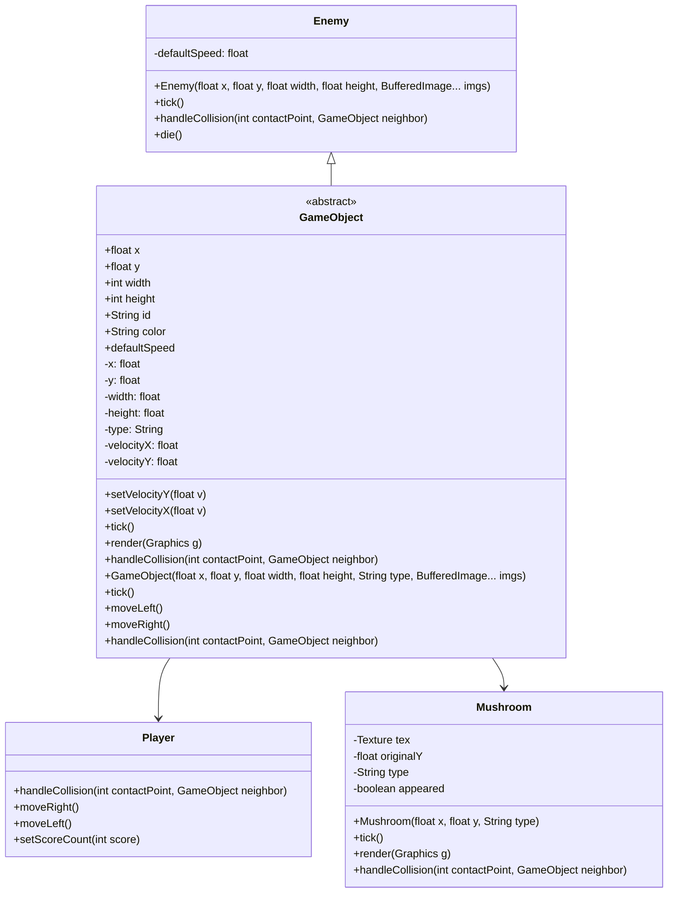
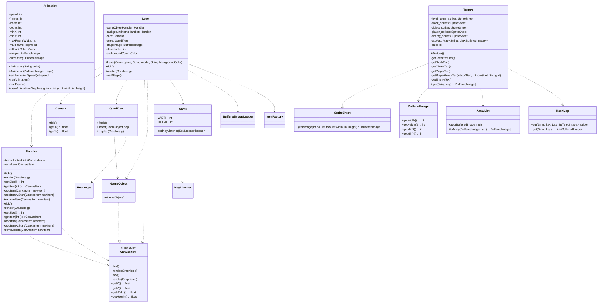
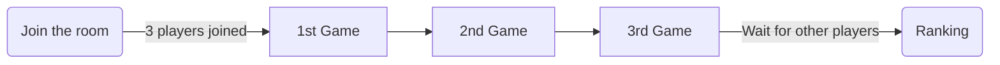
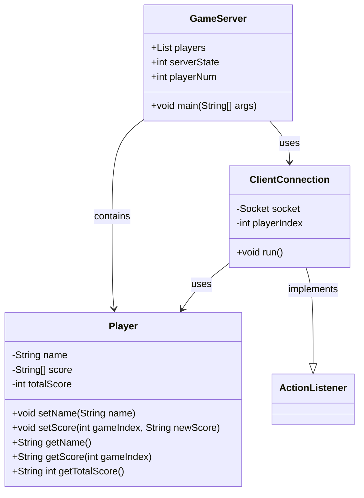

# NCKU股票大進擊

## 動機

身為資工系，一入學的時候充滿了抱負，想要廣泛的學習，增進自己的實力，然後應用所學在有興趣的事情上。

我們設計了一個遊戲來描述資工系的大學生活。

初出茅廬，必須學習好程式語言，才能進行應用。

中期，要學習一些程式以外的知識，學習投資，與寫程式的專長結合。

後期，開始更深入和程式奮鬥，挑戰不同程式語言及應用；同時，避免常常投資失敗變成韭菜。

祝我們都能在未來各自的領域上發光發熱。

## 內容

這是一個多人遊戲系列，在Server端建立房間後，Client端可以進入遊戲房間，
3人到齊，遊戲便會開始。

總共有三個遊戲關卡，

#### (1) JAVA貪食蛇：程式小白鍛鍊計畫

#### (2) Flappy Doge：投資韭菜躲避戰

#### (3) 馬力歐：資工系畢業之路

玩家需要陸續通過這些關卡，最後便能參與成大資工的畢業典禮。
最後會結算三個遊戲的總分，顯示玩家的排名。

# 實作

## JAVA貪食蛇：程式小白鍛鍊計畫

### 概念

蒐集“System.out.println()” 來完成遊戲。
使用鍵盤控制上下左右，控制貪食蛇吃到所有目標字母。
即使完成遊戲，因為少吃了一個";"，還是有可能面臨二一大魔王。

#### 遊戲畫面

#### 遊戲流程

#### Class Diagram

## Flappy Doge：投資韭菜躲避戰

### 概念

用股市的k線圖當作背景，實現flapy bird的遊戲。其中，使用 Doge Coin的圖片作為上下移動的主要標的。隨著過關斬將通過一根根的韭菜(躲避韭菜)，分數持續增加，而k線圖也會追蹤Doge Coin的位置而上下起伏。借助Eclipse的開發工具，加速介面的開發速度。

#### 以contentPane 為基底，增加JPanel

JPanel 的部分有：infoBar, Grids, 格線右邊的數字

#### 遊戲畫面

#### 遊戲流程

#### 格線

override`drawComponent(Graphics g)`，使格線畫在JPanel上。
使用`g.drawLine(x1,y1,x2,y2)`，for迴圈迭代畫出格線。

#### K線

由於畫面佔滿K線之後要將先前畫上去的K線刪除，因此用Deque儲存KLine的object, 只要size超過一定數量就pop front。

每次新增新的KLine後，就要repaint()這個JPanel，然後paintComponent()，因為某些原因repaint()應該要可以call paintComponent() 的，但結果是把整個JPanel上畫好的都刪掉而已。

因此流程改為，每 [timeFrame] ms 新增新的KLine到KLineGraph，然後每[timeFrame/3] ms，call repaint() 刷新JPanel，然後[timeFrame*2] ms後，call paintComponent()。

#### Class Diagram for Doge Game

#### Class Diagram for Dynamic Background

## 韭菜瑪利歐

### 概念

為了運用所學，必須征服一個個的程式語言(敵人)，來增加分數。如果禁止不動的話會變成韭菜，死掉的話會變成韭菜水餃。

### Game Main Code - Class Diagram

### Game Object - Class Diagram

### Frame Work - Class Diagram

方型圓邊：起/始點
正方形: process
菱形:decisiion
平行四邊形: I/O

## Server 以及 Client端設計

使用Java Socket Programming來建立遊戲系統，Client端程式主要設計遊戲視窗與邏輯、向Server求取其他玩家的資訊，Server端主要在指示Client該跳往哪個遊戲狀態、記錄玩家資訊。
Client在此專案的流程如下：

#### Class Diagram for server

# 困難與解決

## 1.專案龐大，不知道如何協作

=>主要依照遊戲劃分工作，並使用專案管理工具

## 2.原本要串Online data base

較熟悉的Firebase只在移動應用(Android和iOS平台)使用過，但是我們是純JAVA視窗設計
=>直接自行使用Socket Programming，設計Server與Client程式

## 3.一開始不知道怎麼讓server和client準確互相傳送訊息

=>採用Server與Client 一問一答的模式

## 4.不熟悉視窗設計

=>上網找尋答案、多次試玩&與隊友討論來Debug

# 專案分工

## 工作分配

#### Seanachan: Flappy Doge遊戲製作

#### JKaiWang: Mario遊戲製作

#### Kuan Yi: Snake遊戲製作、Server & Client端設計

#### PYCHS: 馬力歐遊戲製作

## 分工方式

#### (1) 根據不同功能(遊戲)來分配工作

#### (2) 給定規格(一個遊戲該輸入和輸出的參數)，來串接不同功能

例如：Client端需要將每次遊玩的分數回傳Server，則告訴每一個設計遊戲的組員，需要在class裡算好score member
例如：遊戲設計上都需要實作launch或start method讓Client呼叫遊戲。
=> 給定規格後，中間遊戲的部分如何實現都任意設計者，只要最後有輸出該輸出的資訊即可。

#### (3) 使用Git工具，組員會在不同分支開發自己的部分，若有更動專案程式(main branch)，則需提醒其他人main已經更新。

#### (4) 互相遊玩彼此的遊戲，給出如何改善遊戲的UI/UX

#### (5) 彼此詢問意見、協助組員Debug。
