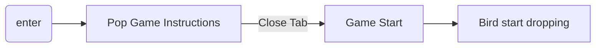
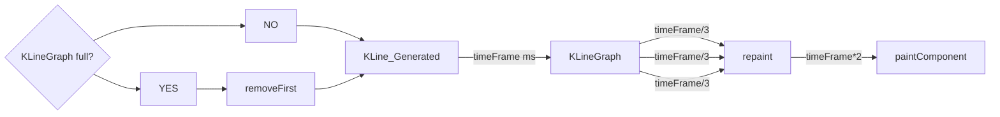
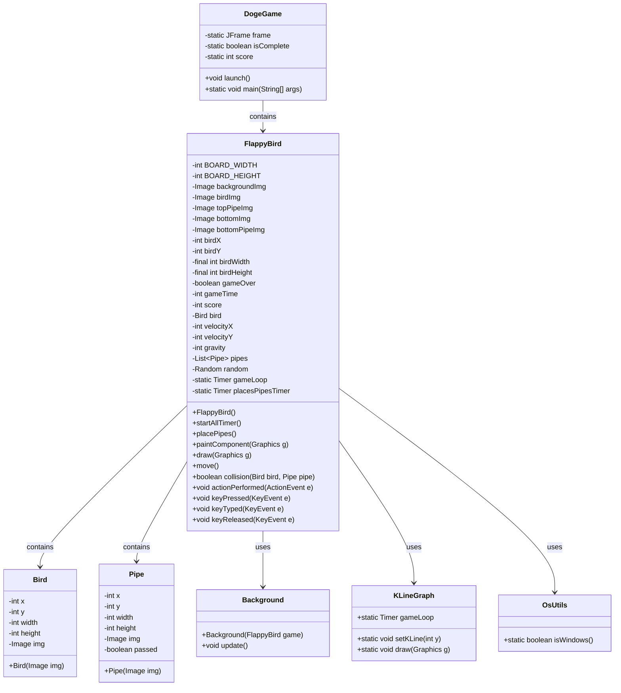
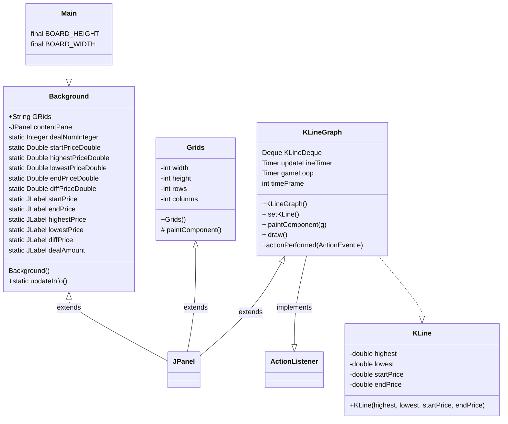
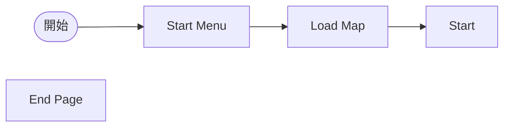

# 股票大進擊

## 動機

身為資工系，一入學的時候充滿了抱負，想要廣泛的學習，增進自己的實力，然後應用所學在有興趣的事情上。

我們設計了一個遊戲來描述資工系的一生。

初出茅廬，必須學習好程式語言，才能進行應用。

中期，要學習一些程式以外的知識，才能和寫程式的專長結合。

後期，開始更深入和程式奮鬥，又曾幾何時感到挫折，常常變成韭菜。

祝我們都能在未來各自的領域上發光發熱。

## 內容

以瑪利歐的遊戲作為基礎，我們除了做出外觀包裝上的更動外，也支援同時多人遊玩。

# 實作

## CISE Snake Game

### 蒐集“System.out.println();” 來完成任務。

## Flappy Doge

### 概念

用股市的k線圖當作背景，實現flapy bird的遊戲。其中，使用 Doge Coin的圖片作為上下移動的主要標的。隨著過關斬將通過一根根的韭菜，分數持續增加，而k線圖也會追蹤Doge Coin的位置而上下起伏。借助Eclipse的開發工具，加速介面的開發速度。

#### 以contentPane 為基底，增加JPanel

JPanel 的部分有：infoBar, Grids, 格線右邊的數字

#### 遊戲流程

#### 格線

override`drawComponent(Graphics g)`，使格線畫在JPanel上。
使用`g.drawLine(x1,y1,x2,y2)`，for迴圈迭代畫出格線。

#### K線

由於畫面佔滿K線之後要將先前畫上去的K線刪除，因此用Deque儲存KLine的object, 只要size超過一定數量就pop front。

每次新增新的KLine後，就要repaint()這個JPanel，然後paintComponent()，因為某些原因repaint()應該要可以call paintComponent() 的，但結果是把整個JPanel上畫好的都刪掉而已。

因此流程改為，每 [timeFrame] ms 新增新的KLine到KLineGraph，然後每[timeFrame/3] ms，call repaint() 刷新JPanel，然後[timeFrame*2] ms後，call paintComponent()。

#### Class Diagram for Doge Game

#### Class Diagram for dynamic Background

方型圓邊：起/始點
正方形: process
菱形:decisiion
平行四邊形: I/O

## 韭菜瑪利歐

### 概念

為了運用所學，必須征服一個個的程式語言(敵人)，來增加分數。如果禁止不動的話會變成韭菜，死掉的話會變成韭菜水餃。
