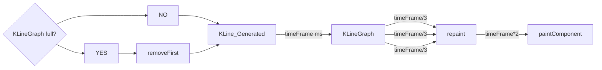

# 股票大進擊

## 動機

今日台股的表現讓投資人充滿了信心，包括我們在內，也都一邊看著code，一邊看著股票上上下下。適逢期末，我們想結合這個共同的興趣作為idea，使用java做出一個有趣的小遊戲。

## 內容

以瑪利歐的遊戲作為基礎，我們除了做出外觀包裝上的更動外，也支援同時多人遊玩。

# 實作

## 背景

Goal: 實現近似於股市k線圖的背景，隨著散戶奔跑而起伏。
History: 歷經使用VScode手刻code之後發現過於繁雜，改使用Eclipse的windowBuidler作為開發工具。

### 以contentPane 為基底，增加JPanel

JPanel 的部分有：infoBar, Grids, 格線右邊的數字

### 格線

override`drawComponent(Graphics g)`，使格線畫在JPanel上。
使用`g.drawLine(x1,y1,x2,y2)`，for迴圈迭代畫出格線。

### K線

由於畫面佔滿K線之後要將先前畫上去的K線刪除，因此用Deque儲存KLine的object, 只要size超過一定數量就pop front。

每次新增新的KLine後，就要repaint()這個JPanel，然後paintComponent()，因為某些原因repaint()應該要可以call paintComponent() 的，但結果是把整個JPanel上畫好的都刪掉而已。

因此流程改為，每 [timeFrame] ms 新增新的KLine到KLineGraph，然後每[timeFrame/3] ms，call repaint() 刷新JPanel，然後[timeFrame*2] ms後，call paintComponent()。

## 遊戲內容

退後5pixel股價跌1%

往前5pixel股價漲1%

如果停止超過兩秒每秒跌2%

碰到壞蘑菇股價跌10%

吃到好蘑菇漲5%

往後>1120pixel 跌停

## Graphs

