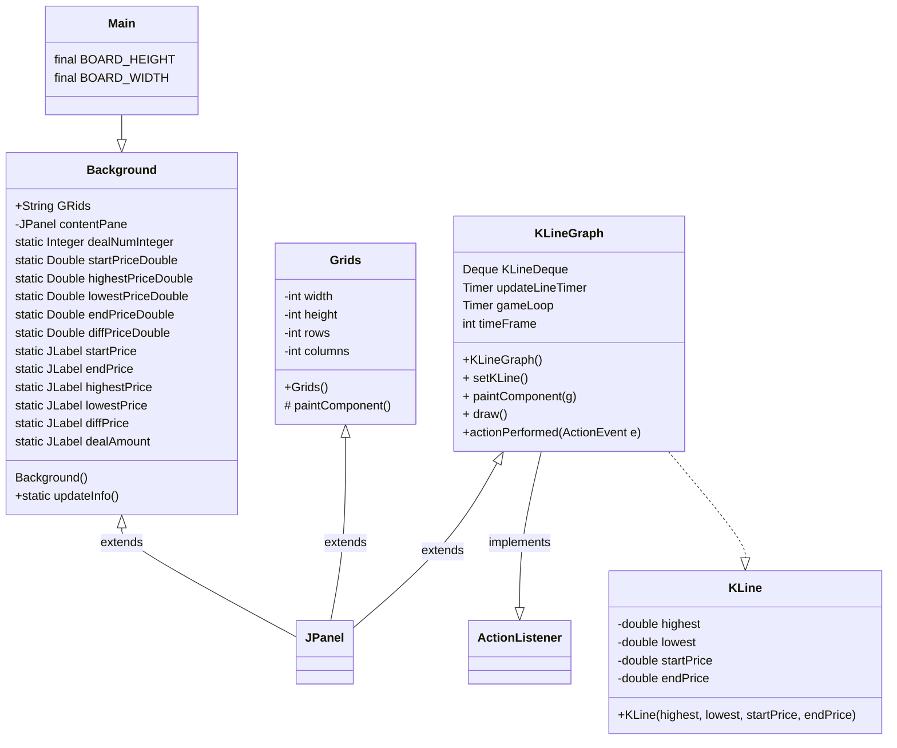

```mermaid
classDiagram
Background <|--JPanel :extends
Grids <|--JPanel  :extends
KLineGraph <|--JPanel :extends
KLineGraph --|> ActionListener :implements
KLineGraph ..|> KLine
Main --|> Background
class Main{
  final BOARD_HEIGHT
  final BOARD_WIDTH
}
class Background{
  +String GRids
  -JPanel contentPane
  static Integer dealNumInteger
  static Double startPriceDouble
  static Double highestPriceDouble
  static Double lowestPriceDouble
  static Double endPriceDouble
  static Double diffPriceDouble

  static JLabel startPrice
  static JLabel endPrice 
  static JLabel highestPrice
  static JLabel lowestPrice
  static JLabel diffPrice
  static JLabel dealAmount
  Background()
  +static updateInfo()
}
class Grids{
  +Grids()
  -int width
  -int height
  -int rows
  -int columns

  # paintComponent()
}
class KLine{
  -double  highest
  -double  lowest
  -double  startPrice
  -double  endPrice
  +KLine(highest, lowest, startPrice, endPrice)
}

class KLineGraph {
  
  Deque<KLine> KLineDeque
  Timer updateLineTimer
  Timer gameLoop
  int timeFrame
  +KLineGraph()
  + setKLine()
  + paintComponent(g)
  + draw()
  +actionPerformed(ActionEvent e)
 
}
  
```
