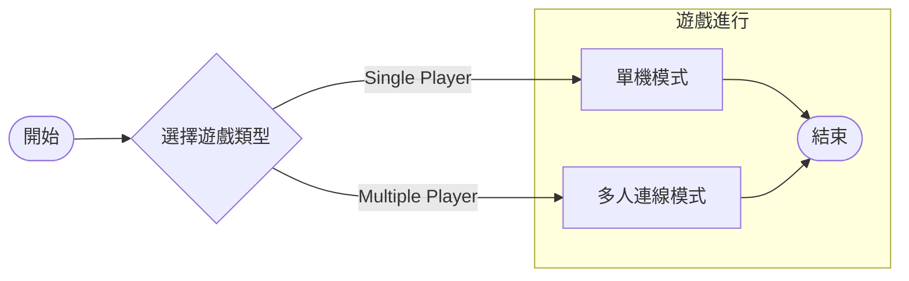

方型圓邊：起/始點
正方形: process
菱形:decisiion
平行四邊形: I/O

```mermaid
graph LR
  id1([開始]) --> id2{選擇遊戲類型}--Single Player---> id3[單機模式]
 id2{選擇遊戲類型} --Multiple Player---> id4[Multiple Player]

subgraph 遊戲進行
  id3[單機模式] --> id5([結束])
  id4[多人連線模式] --> id5([結束])
end
```

